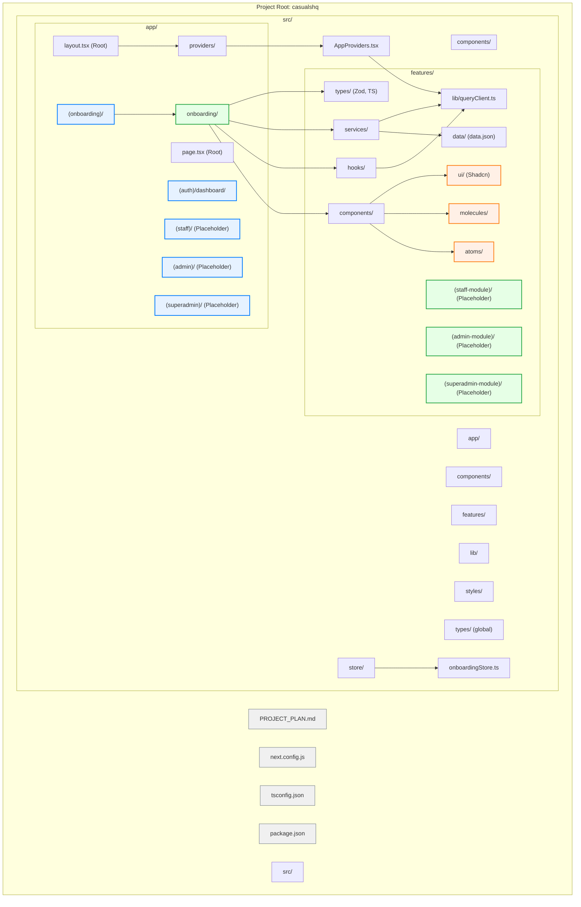

# CasualsHQ - Project Plan

## 1. Overview

This document outlines the architectural plan and development strategy for the "CasualsHQ" web application. The application will be built using Next.js, TypeScript, React, Tailwind CSS, Shadcn UI, TanStack Query, TanStack Table, Zustand, React Hook Form, and Zod. It will feature four distinct, independently accessible sections: Main Onboarding, Staff, Admin, and Superadmin, all within a single Next.js application.

The initial development focus will be on the **Main Onboarding** section, adhering to the UI/UX specifications from the provided Figma design.

## 2. Core Principles

*   **Clean Architecture:** Maintain a clear separation of concerns.
*   **Composable Components:** Utilize an atomic design approach for UI components.
*   **Robust State Management:** Leverage Zustand for global/cross-feature state and TanStack Query for server state.
*   **Comprehensive Testing:** Implement unit and integration tests.
*   **Scalability & Maintainability:** Design for future growth and ease of updates.
*   **Modular Design:** Structure the application to support independent development and understanding of different sections.

## 3. Technology Stack

*   **Framework:** Next.js 14+ (App Router)
*   **Language:** TypeScript
*   **UI Library:** React
*   **Styling:** Tailwind CSS
*   **UI Components:** Shadcn UI
*   **Server State & Data Fetching:** TanStack Query
*   **Client State Management:** Zustand
*   **Forms:** React Hook Form
*   **Schema Validation:** Zod
*   **Tables:** TanStack Table (for future sections)
*   **Testing:** Vitest/Jest + React Testing Library

## 4. Project Setup & Core Architecture

### 4.1. Initialization
*   Next.js: `npx create-next-app@latest casualshq --typescript --tailwind --eslint --app --src-dir --import-alias "@/*"`
*   Shadcn UI: `npx shadcn-ui@latest init` (configure components to `@/components/ui`)
*   Core Dependencies: `npm install @tanstack/react-query zustand react-hook-form zod @hookform/resolvers`

### 4.2. Folder Structure

The proposed folder structure is designed to be modular and scalable to accommodate all planned sections of the application.

```
src/
├── app/                   # Next.js App Router (Routing & Pages)
│   ├── (auth)/            # Routes requiring authentication (e.g., dashboard)
│   │   └── dashboard/
│   │       └── page.tsx
│   ├── (main-onboarding)/ # Onboarding specific routes
│   │   ├── sign-up/
│   │   │   └── page.tsx
│   │   ├── setup-organization/
│   │   │   └── page.tsx
│   │   ├── create-password/
│   │   │   └── page.tsx
│   │   └── layout.tsx     # Layout specific to onboarding flow
│   ├── staff/             # containing all routes for Staff section
│   │   └── layout.tsx     # Example: Staff specific layout
│   │   └── page.tsx       # Example: Staff dashboard
│   ├── (admin)/           # Placeholder for Admin section routes
│   │   └── layout.tsx
│   │   └── page.tsx
│   ├── layout.tsx         # Root layout
│   └── page.tsx           # Root page (e.g., landing or redirect logic)
├── components/            # Globally shared UI components (Atomic Design)
│   ├── atoms/             # Basic building blocks (Button, Input, Logo etc.)
│   ├── molecules/         # Combinations of atoms (e.g., LabeledInput)
│   └── ui/                # Shadcn UI components (e.g., from `npx shadcn-ui add button`)
├── features/              # Feature-specific modules (e.g., onboarding, staff-management)
│   ├── main-onboarding/   # main-Onboarding feature module
│   │   ├── components/    # Organisms, Templates, Pages specific to onboarding
│   │   ├── hooks/         # Feature-specific hooks (e.g., useOnboardingStep)
│   │   ├── services/      # Data fetching/mutation logic (using TanStack Query)
│   │   └── types/         # Zod schemas and TypeScript types for onboarding
│   └── (staff-management)/ # Placeholder for a future feature module
│       ├── components/
│       ├── services/
│       └── types/
├── lib/                   # Utility functions, helpers, constants
│   ├── queryClient.ts     # TanStack Query client setup
│   └── utils.ts           # General utility functions
├── providers/             # React Context providers
│   └── AppProviders.tsx   # Main provider component (QueryClientProvider, etc.)
├── store/                 # Zustand stores
│   ├── mainOnboardingStore.ts # Store for onboarding state
│   └── (userStore.ts)     # Example: Future store for user session
├── styles/                # Global styles
│   └── globals.css
├── types/                 # Global TypeScript types/interfaces
│   └── index.ts
└── data/                  # Dummy data for development
    └── data.json          # JSON file for simulating API responses
```

### 4.3. Providers Setup
*   Create `src/providers/AppProviders.tsx` to wrap the application with `QueryClientProvider` and any other global providers.
*   Wrap the root layout (`src/app/layout.tsx`) with `AppProviders`.

## 5. Main Onboarding Section Implementation (Initial Focus)

### 5.1. Routing
Implement routes as defined in `src/app/(onboarding)/`.

### 5.2. Layout
Create `src/app/(onboarding)/layout.tsx` for the consistent onboarding header/structure.

### 5.3. Component Development (Atomic Design)
*   **Atoms (`src/components/atoms`):** Basic UI elements (e.g., `Button`, `Input`, `Logo`). Leverage Shadcn UI.
*   **Molecules (`src/components/molecules`):** Combinations of atoms (e.g., `FormFieldWithLabel`).
*   **Organisms/Templates (`src/features/onboarding/components`):**
    *   `SignUpForm.tsx`
    *   `OrganizationForm.tsx`
    *   `PasswordForm.tsx`
    *   `OnboardingHeader.tsx`
    *   Page components in `src/app/(onboarding)/**/page.tsx` will compose these.

### 5.4. State Management
*   **Forms:** React Hook Form (`useForm`) with Zod (`zodResolver`) for validation. Schemas in `src/features/onboarding/types/`.
*   **Cross-Step State:** Zustand store (`src/store/onboardingStore.ts`) for data persisting across onboarding steps and current step management.

### 5.5. Data Fetching & Mutation (Simulated with `data.json`)
*   **`data.json`:** A `src/data/data.json` file will be used to store representative dummy data. For the onboarding flow, this might initially include an empty array for users or organizations, which the simulated API calls will interact with.
    ```json
    // Example src/data/data.json
    {
      "users": [],
      "organizations": []
    }
    ```
*   **Services (`src/features/onboarding/services/`):**
    *   Define asynchronous functions that simulate API calls. These functions will read from and write to `data.json` (in a real backend scenario, these would be actual API calls).
    *   For Next.js environments, direct file system access to `data.json` for reads might be done via `fs` module in API routes or server components if needed, or fetched if `data.json` is placed in `public/`. For mutations, API routes would be the standard way to modify `data.json` on the server side.
    *   Initially, for client-side simulation with TanStack Query, service functions can mimic this by returning Promises with mock data or by interacting with a global object that represents `data.json` content (if not using actual file I/O for simulation).
*   **TanStack Query:** Use `useMutation` for form submissions and `useQuery` if any data needs to be fetched during onboarding (though less likely for initial steps).
*   **Workflow:**
    1.  User submits form.
    2.  React Hook Form validates data.
    3.  `useMutation` calls a service function.
    4.  Service function simulates API call (e.g., "saving" to a representation of `data.json` or logging).
    5.  On success: Update Zustand store, navigate to the next step or dashboard.

## 6. Testing Strategy

*   **Unit Tests (Vitest/Jest + RTL):**
    *   Individual components (Atoms, Molecules).
    *   Utility functions (`src/lib/utils.ts`).
    *   Zustand store logic and actions.
    *   Zod schema validations.
*   **Integration Tests (Vitest/Jest + RTL):**
    *   Form submissions within each onboarding step (validation, mock mutation, state updates).
    *   Navigation flow between onboarding steps.
    *   Interaction between components in a feature (e.g., `SignUpForm` interactions).

## 7. Future Sections (Staff, Admin, Superadmin)

The architecture (modular `features/` directory, route groups in `app/`) is designed to accommodate these sections. Each section will likely:
*   Have its own route group (e.g., `src/app/(staff)/`).
*   Have its own feature module (e.g., `src/features/staff-portal/`).
*   Utilize shared components from `src/components/`.
*   Have its own Zustand stores if complex client-side state is needed.
*   Use TanStack Query for data fetching and mutations, interacting with `data.json` initially, then with the real backend.

## 8. Architecture Visualization (Mermaid)



This plan provides a solid foundation for building CasualsHQ, starting with the Main Onboarding section and designed for future expansion.